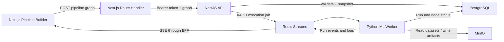

# ML Training Platform

## Pipeline Execution: Implementation & Demo

Tài liệu này mô tả đặc tả triển khai cho luồng chạy ML pipeline end-to-end:

- Frontend gửi pipeline graph hiện tại.
- NestJS API xác thực, validate và lưu immutable run snapshot.
- Python worker nhận job qua Redis Streams và thực thi DAG.
- Trạng thái, log và kết quả được stream về frontend bằng Server-Sent Events (SSE).
- Demo chuẩn sử dụng bộ dữ liệu Kaggle Iris.

> [!NOTE]
> Block catalog hiện tại có **17 block**. Mục tiêu của kế hoạch là triển khai đầy đủ cả 17 block, dù pipeline Iris demo chỉ sử dụng 6 block.

## Trạng thái triển khai

V1 trong tài liệu này đã được triển khai:

- shared contracts cho graph, execution job, run detail và SSE events;
- NestJS execute API, immutable graph snapshot, validation, ownership và Redis Streams;
- Python DAG worker với đủ 17 executor, PostgreSQL, MinIO và structured events;
- Next.js BFF, SSE reconnect/replay, trạng thái node, logs, metrics và confusion matrix;
- one-click Iris graph preset và fixture `examples/iris/Iris.csv`;
- migration, Docker Compose, MinIO initialization và automated tests.

Các kiểm tra local hiện tại:

- monorepo TypeScript typecheck: **4/4 packages pass**;
- Jest: **87 tests pass** (`35` pipeline-engine, `10` API, `42` web);
- Pytest: **37 tests pass**, bao gồm mocked Iris end-to-end run và smoke CLI tests;
- production build: contracts, pipeline-engine, API và web đều pass;
- Docker Compose config validation và Python worker image build đều pass;
- live worker smoke trên PostgreSQL, Redis và MinIO: **6/6 nodes completed**,
  accuracy **0.933333**, confusion matrix **3 x 3**, metrics artifact persisted.

Smoke CLI cũng đã xác minh cleanup không để lại run, dataset, artifact,
Redis event stream hoặc MinIO object.
development keys của người chạy và được mô tả bên dưới.

## 1. Target architecture



### Execution scope for v1

- Một Python worker xử lý một run theo thứ tự topological.
- Các node trong một run chạy tuần tự.
- Run và node status được lưu trong PostgreSQL.
- Log được lưu tạm trong Redis Streams và có thể reconnect trong vòng 24 giờ.
- Intermediate DataFrame và model chỉ tồn tại trong memory.
- Chỉ metrics và explicit Save Model được persist vào MinIO.
- Chưa triển khai automatic retry, cancellation, parallel branches, worker crash recovery hoặc resume giữa pipeline.

## 2. Public contracts

Các schema dùng chung được đặt trong `@training-ml/contracts` và dùng ở FE, API lẫn tests.

### Pipeline graph

```ts
interface PipelineGraph {
  nodes: PipelineGraphNode[];
  edges: PipelineGraphEdge[];
}

interface PipelineGraphNode {
  id: string;
  blockId: string;
  blockVersion: number;
  config: Record<string, unknown>;
}

interface PipelineGraphEdge {
  id: string;
  sourceNodeId: string;
  sourcePortId: string;
  targetNodeId: string;
  targetPortId: string;
}
```

Schema phải kiểm tra:

- Có ít nhất một node.
- Node ID và edge ID không trùng.
- Mọi edge đều tham chiếu node tồn tại.
- Source và target port tồn tại trong block definition tương ứng.
- Không có self-edge hoặc cycle.
- Mọi `(blockId, blockVersion)` tồn tại và đang active.

### Execute request

```ts
interface ExecuteWorkflowRunRequest {
  graph: PipelineGraph;
  workflowVersionId?: string;
}
```

Frontend không được gửi:

- run status;
- node status;
- artifact metadata do hệ thống quản lý.

API luôn lưu một immutable graph snapshot, kể cả khi request có `workflowVersionId`.

### Accepted response

```ts
interface WorkflowRunAccepted {
  runId: string;
  status: "pending";
  eventsUrl: string;
}
```

API trả HTTP `202 Accepted` sau khi database transaction hoàn tất và execution job đã được ghi vào Redis.

### Run event

```ts
interface RunEvent {
  type:
    | "run.snapshot"
    | "run.queued"
    | "run.started"
    | "node.started"
    | "node.log"
    | "node.completed"
    | "node.failed"
    | "artifact.created"
    | "run.completed"
    | "run.failed";
  runId: string;
  timestamp: string;
  nodeId?: string;
  level?: "debug" | "info" | "warning" | "error";
  message?: string;
  payload?: Record<string, unknown>;
}
```

SSE wire format:

```text
id: 1784731452210-0
event: node.completed
data: {"type":"node.completed","runId":"...","nodeId":"...","timestamp":"...","payload":{"durationMs":81}}
```

## 3. Stable block identity

Database UUID của block được sinh động bởi migration nên Python worker không được map trực tiếp từ UUID sang implementation.

Thêm field bắt buộc `executorKey` vào block definition và unique constraint:

```text
UNIQUE (executor_key, version)
```

| Catalog block | Version | `executorKey` |
|---|---:|---|
| Load CSV | 1 | `load_csv` |
| Load JSON | 1 | `load_json` |
| Load XML | 1 | `load_xml` |
| Normalization | 3 | `normalize` |
| Encoding | 1 | `encode` |
| Impute Missing Values | 1 | `impute_missing` |
| Feature Selection | 1 | `feature_select` |
| Select Target | 1 | `select_target` |
| Rename Column | 1 | `rename_columns` |
| Concat Features | 1 | `concat_features` |
| Train/Test Split | 1 | `train_test_split` |
| Random Forest | 1 | `random_forest` |
| Logistic Regression | 1 | `logistic_regression` |
| SVM | 1 | `svm` |
| K-Means | 1 | `kmeans` |
| Evaluation | 1 | `evaluate` |
| Save Model | 1 | `save_model` |

Tạo migration mới để thêm và backfill `executor_key` theo tên block. Không sửa migration cũ đã có thể được áp dụng ở môi trường khác.

## 4. Database changes

### Workflow runs

Thêm hoặc thay đổi các field:

- `graph_snapshot jsonb NOT NULL`;
- `workflow_version_id` nullable;
- `started_at` nullable;
- `finished_at` nullable.

`dataset_id` hiện tại được giữ tạm để tương thích migration cũ nhưng không còn là nguồn dữ liệu chính cho run mới.

### Run datasets

Tạo bảng liên kết:

```text
workflow_run_datasets
  run_id uuid references workflow_runs(id)
  dataset_id uuid references datasets(id)
  primary key (run_id, dataset_id)
```

Bảng này cần thiết vì Concat Features có thể làm một run tham chiếu nhiều dataset source.

### Node executions

Thêm:

- `error_message text NULL`;
- `output_summary jsonb NULL`.

API tạo sẵn một node execution cho mỗi graph node với status `pending`.

Python worker cập nhật:

- `running` và `started_at` trước khi emit `node.started`;
- `completed` và `finished_at` trước khi emit `node.completed`;
- `failed` và `error_message` trước khi emit `node.failed`;
- `skipped` cho các node chưa chạy sau khi run bị abort.

### Artifacts

Không tạo artifact cho mọi intermediate value.

V1 chỉ persist:

- `metrics.json` từ Evaluation;
- model file từ Save Model.

Artifact response schema phải cho phép `metadata` nullable đúng với entity hiện tại.

## 5. NestJS API

### Execute endpoint

```text
POST /v1/workflow-runs/execute
```

Processing order:

1. Nhận request và validate graph.
2. Parse request bằng Zod.
3. Load tất cả block definitions theo `(blockId, blockVersion)`.
4. Load các dataset được tham chiếu bởi source nodes.
5. Kiểm tra dataset thuộc user, status `READY` và đúng format.
6. Dùng `pipeline-engine` validate graph với columns lấy từ dataset profile.
7. Nếu invalid, trả `422` với danh sách `ValidationError`.
8. Trong một database transaction:
   - tạo workflow run;
   - lưu graph snapshot;
   - tạo run-dataset relations;
   - tạo node executions.
9. Ghi execution job vào Redis Stream.
10. Emit `run.queued` và trả `202`.

Cycle hoặc graph structure invalid phải trở thành validation error, không được để `topologicalSort` throw thành HTTP 500.

### Run detail

```text
GET /v1/workflow-runs/:runId
```

Response gồm:

- run status và timestamps;
- workflow version nếu có;
- dataset IDs;
- node executions;
- artifacts.

Chỉ owner của run được đọc.

### SSE events

```text
GET /v1/workflow-runs/:runId/events
```

Yêu cầu:

- Auth và ownership check.
- Hỗ trợ `Last-Event-ID` header hoặc query `after`.
- Gửi `run.snapshot` đầu tiên từ database.
- Đọc Redis bằng `XREAD` từ event ID gần nhất.
- Gửi SSE comment keepalive mỗi 15 giây.
- Đóng connection sau terminal `run.completed` hoặc `run.failed`.
- Không đi qua JSON serializer interceptor.
- Headers:
  - `Content-Type: text/event-stream`;
  - `Cache-Control: no-cache, no-transform`;
  - `Connection: keep-alive`.

Redis event stream:

```text
ml:workflow:runs:{runId}:events
```

Giới hạn khoảng 10.000 event và TTL 24 giờ.

### Execution endpoint security

- Client không được tự tạo hoặc sửa NodeExecution và Artifact.
- Các mutation controller hiện có cho execution entities chuyển thành internal/admin-only.
- Dataset list/read/update/delete phải scope theo owner.
- Client-provided data được validate qua Zod schema.

## 6. Redis integration

Dataset validation tiếp tục sử dụng BullMQ như hiện tại.

Workflow execution sử dụng Redis Streams trực tiếp vì producer là TypeScript và consumer là Python:

```text
Job stream:     ml:workflow:jobs
Consumer group: python-workers
Event stream:   ml:workflow:runs:{runId}:events
```

Job payload:

```ts
interface WorkflowExecutionJob {
  schemaVersion: 1;
  runId: string;
  graph: PipelineGraph;
  blocks: Record<
    string,
    {
      id: string;
      version: number;
      executorKey: string;
      name: string;
      ports: BlockDefinition["ports"];
    }
  >;
  datasets: Record<
    string,
    {
      id: string;
      objectKey: string;
      format: "csv" | "json" | "xml";
      validationOptions?: Record<string, unknown>;
    }
  >;
}
```

Required API fixes:

- Load `redis.config` trong `AppModule`.
- Thêm Redis client provider dành cho stream operations.
- Giữ BullMQ connection riêng cho dataset queue.
- Nếu enqueue thất bại, đánh dấu run `failed` và trả service-unavailable response có `runId`.

## 7. Python worker runtime

### Core abstractions

```py
class DatasetValue:
    frame: pandas.DataFrame
    target: str | None
    task: str | None
    role: str
    lineage: list[str]

class ModelValue:
    estimator: object
    algorithm: str
    task: str
    feature_columns: list[str]
    target_column: str | None

class MetricsValue:
    metrics: dict[str, float]
    confusion_matrix: dict | None

class BlockResult:
    outputs: dict[str, object]
    summary: dict
```

Mỗi block implement:

```py
class Block:
    executor_key: str
    version: int

    def execute(self, context, inputs, config) -> BlockResult:
        ...
```

### Registry

`registry.py` map:

```py
(executor_key, version) -> block class
```

Worker startup phải fail fast khi:

- duplicate registration;
- implementation thiếu key/version;
- job dùng executor không có trong registry.

### Runner

`runner.py` chịu trách nhiệm:

- parse job schema version;
- claim job bằng Redis consumer group;
- kiểm tra run vẫn là `pending`;
- topological sort graph;
- resolve input theo edge và port;
- lưu output theo `outputs[nodeId][portId]`;
- cập nhật DB và emit event;
- ACK job sau terminal state.

Nếu một node thất bại:

1. node hiện tại thành `failed`;
2. mọi node còn pending thành `skipped`;
3. run thành `failed`;
4. emit `node.failed`, sau đó `run.failed`;
5. ACK job để v1 không retry tự động.

Worker upsert hostname vào bảng workers khi start và đổi `busy/idle` ở ranh giới run. V1 chưa có periodic heartbeat hoặc stale-job reclaim.

### Runtime conventions

- Mọi random algorithm dùng `random_state=42`.
- `columns` và `metrics` nhận cả array lẫn comma-separated string.
- `mapping` nhận object hoặc JSON object string.
- Error message phải chứa node ID, executor key và invalid config/input.
- Không log raw dataset rows hoặc secrets.
- Log có timestamp, level, run ID và node ID.

## 8. Python block behavior

### Data sources

#### Load CSV

- Resolve dataset từ `config.dataset`.
- Kiểm tra descriptor format là CSV.
- Download object từ MinIO về temporary file.
- Dùng delimiter, header và encoding từ dataset validation options.
- Trả `DatasetValue` với role `full`, target/task ban đầu là `None`.

#### Load JSON

- Hỗ trợ root array.
- Hỗ trợ object chứa record array qua `recordsPath`.
- Reject scalar root hoặc record không thể chuyển thành table.

#### Load XML

- Dùng `recordElement` từ validation options.
- Flatten nested scalar fields theo cùng convention với dataset validator.
- Reject XML không có record.

### Preprocessing

#### Normalization

- Strategies: Standard, MinMax, Robust.
- Chỉ xử lý selected numeric columns.
- Reject cột không tồn tại hoặc không numeric.
- Giữ nguyên column names, target, task và role.

#### Encoding

- OneHot tạo column names deterministic.
- Label encode từng selected column.
- Ordinal dùng deterministic category ordering.
- Reject selected column không tồn tại.
- Update output DataFrame schema.

#### Impute Missing Values

- Strategies: Mean, Median, Mode, Constant.
- Dùng `SimpleImputer`.
- Mean/Median chỉ áp dụng numeric columns.
- Constant value được coerce theo dtype khi có thể.

#### Feature Selection

- Parse comma-separated string hoặc array.
- Giữ cột đúng thứ tự config.
- Reject cột không tồn tại.
- Nếu target đã được chọn, target bắt buộc nằm trong danh sách.

#### Select Target

- Không thay đổi DataFrame.
- Classification/regression bắt buộc target column tồn tại.
- Clustering đặt target thành `None`.
- Gắn `task` và `target` metadata vào output dataset.

#### Rename Column

- Nhận mapping object hoặc JSON object string.
- Reject source column không tồn tại.
- Reject duplicate output names.
- Cập nhật target metadata nếu target bị rename.

#### Concat Features

- Yêu cầu hai input có cùng row count.
- Reset index trước khi concat.
- Reject duplicate column names.
- Task, target và role của hai input phải tương thích.
- Target lấy từ input có target; nếu cả hai có target khác nhau thì fail.

### Data split

#### Train/Test Split

- Dùng `testSize`.
- Luôn dùng `random_state=42`.
- Classification + `stratify=true`: stratify theo target.
- Regression/clustering: không stratify và emit warning nếu config bật.
- Outputs:
  - `train`: role `train`;
  - `test`: role `test`.

### Models

#### Random Forest

- Classification dùng `RandomForestClassifier`.
- Regression dùng `RandomForestRegressor`.
- Config: `n_estimators`, `max_depth`.
- `n_jobs=-1`, `random_state=42`.

#### Logistic Regression

- Chỉ hỗ trợ classification.
- Config: `penalty`, `C`.
- Map `"none"` thành Python `None`.
- Chọn solver phù hợp `l1/l2`.
- `max_iter=1000`, `random_state=42`.

#### SVM

- Classification dùng `SVC`.
- Regression dùng `SVR`.
- Config: `kernel`, `C`.

#### K-Means

- Chỉ nhận numeric features.
- Config: `n_clusters`.
- Dùng `n_init="auto"` và `random_state=42`.

Mọi supervised model:

- bỏ target column khỏi feature matrix;
- giữ đúng feature order;
- reject remaining categorical features chưa encode;
- lưu task, feature columns và target trong `ModelValue`.

### Evaluation

Nếu `metrics` rỗng, dùng defaults theo task.

Classification:

- accuracy;
- precision macro;
- recall macro;
- F1 macro;
- confusion matrix với labels.

Regression:

- MAE;
- MSE;
- RMSE;
- R².

Clustering:

- silhouette score;
- inertia trên evaluation dataset.

Output:

- port `metrics`;
- `MetricsValue`;
- `metrics.json` trong MinIO;
- artifact type `metric`;
- `artifact.created` event.

### Save Model

Supported formats:

- Joblib cho mọi model.
- Pickle cho mọi model.
- ONNX cho Random Forest, Logistic Regression và SVM.
- K-Means + ONNX trả config error theo giới hạn catalog hiện tại.

Object path:

```text
runs/{runId}/artifacts/{nodeId}/{modelName}.{extension}
```

Output artifact chứa:

- algorithm;
- task;
- feature columns;
- target column;
- serialization format;
- scikit-learn version.

## 9. Frontend execution experience

### Next.js BFF

Tạo Route Handlers:

```text
POST /api/workflow-runs/execute
GET  /api/workflow-runs/[runId]/events
```

Các route:

- proxy request đến NestJS API;
- forward token sang Nest API;
- không expose internal API URL cho browser;
- proxy SSE body bằng `ReadableStream`;
- dùng Node.js runtime;
- dynamic/no-cache;
- không buffer response.

### `usePipelineRun`

Hook client quản lý:

- submit graph từ `toValidationGraph`;
- current run ID;
- last SSE event ID;
- run status;
- logs;
- node statuses;
- metrics và artifacts.

`activeRunId` và last event ID được giữ trong `sessionStorage` để reconnect trong cùng browser session.

### Builder behavior

Trong lúc run:

- khóa graph mutation và config edit;
- disable Run button;
- chuyển tất cả block node sang `queued`;
- `node.started` chuyển node sang `running`;
- `node.completed` chuyển sang `success`;
- `node.failed` chuyển sang `error`;
- console tự scroll khi user đang ở cuối;
- terminal event mở metrics result.

Metrics UI:

- scalar metric cards;
- confusion matrix table;
- run duration;
- link tới persisted artifacts.

## 10. Kaggle Iris demo

Repo có sẵn fixture tương thích Kaggle tại:

```text
examples/iris/Iris.csv
```

Nguồn dataset:

- [Kaggle Iris Species](https://www.kaggle.com/datasets/uciml/iris)
- Dataset ID: `uciml/iris`
- File: `Iris.csv`

Có thể dùng file đi kèm repo hoặc download lại từ Kaggle:

```bash
kaggle datasets download -d uciml/iris --unzip
```

Không để worker download Kaggle khi chạy. Kaggle chỉ là nguồn fixture; file phải được upload qua Dataset UI để đi đúng luồng MinIO và PostgreSQL.

### Local quick start

Yêu cầu: Node.js 20+, npm 10+, Docker Desktop.

Từ thư mục root:

```powershell
npm install
Copy-Item .env.example apps/services/api/.env
```

Thay `CLERK_SECRET_KEY` trong `apps/services/api/.env` bằng development secret thật. Tạo `apps/web/.env.local`:

```dotenv
NEXT_PUBLIC_CLERK_PUBLISHABLE_KEY=pk_test_replace_me
CLERK_SECRET_KEY=sk_test_replace_me
API_URL=http://localhost:3001/v1
```

Start infrastructure:

```powershell
docker compose --env-file apps/services/api/.env -f apps/services/api/docker-compose.yaml up -d postgres redis minio minio-init
docker compose --env-file apps/services/api/.env -f apps/services/api/docker-compose.yaml ps
```

Build API và chạy migrations:

```powershell
npm run build -w packages/contracts
npm run build -w packages/pipeline-engine
npm run build -w apps/services/api
npm run migration:run -w apps/services/api
```

Start worker:

```powershell
docker compose --env-file apps/services/api/.env -f apps/services/api/docker-compose.yaml up -d --build worker
```

Start API và web trong hai terminal riêng:

```powershell
npm run dev -w apps/services/api
```

```powershell
npm run dev -w apps/web
```

### Headless infrastructure smoke

Sau khi infrastructure và worker đã chạy, có thể kiểm tra PostgreSQL, Redis,
MinIO và toàn bộ sáu Python blocks:

```powershell
docker compose --env-file apps/services/api/.env -f apps/services/api/docker-compose.yaml run --rm --no-deps --volume "${PWD}/examples/iris/Iris.csv:/tmp/Iris.csv:ro" worker python scripts/iris_smoke_demo.py /tmp/Iris.csv --cleanup --timeout 120
```

Script in toàn bộ structured events, metrics và confusion matrix. Cleanup chỉ
nhắm đúng UUID/object key do invocation hiện tại tạo và được bật mặc định; dùng
`--keep` nếu cần giữ kết quả để debug. Smoke CLI cố ý đi thẳng qua canonical
Redis job contract.

### Demo preparation

1. Hoàn tất local quick start ở trên.
2. Mở web và đăng nhập.
3. Vào Dataset UI, upload `examples/iris/Iris.csv` với format CSV.
4. Chờ dataset status thành `READY`.
5. Vào Builder và chọn dataset vừa upload trong ô **READY CSV dataset**.
6. Nhấn **Iris Demo** để tạo graph sáu node.
7. Nhấn **Run**.
8. Theo dõi node status, logs, metrics và confusion matrix trong execution panel.

### Builder demo preset

Thêm action **Load Iris Demo**:

1. User chọn một READY CSV dataset.
2. FE lookup block definitions bằng `executorKey`.
3. FE dùng UUID/version thực tế để tạo nodes và edges.
4. Nếu canvas đang có graph, yêu cầu xác nhận trước khi replace.

Pipeline:

```text
Load CSV
  -> Feature Selection
  -> Select Target
  -> Train/Test Split
  -> Random Forest
  -> Evaluation
```

Configs:

```json
{
  "featureSelection": {
    "columns": "SepalWidthCm,SepalLengthCm,PetalLengthCm,PetalWidthCm,Species"
  },
  "selectTarget": {
    "targetColumn": "Species",
    "task": "classification"
  },
  "trainTestSplit": {
    "testSize": 0.2,
    "stratify": true
  },
  "randomForest": {
    "n_estimators": 100,
    "max_depth": 10
  },
  "evaluation": {
    "metrics": ""
  }
}
```

Expected result:

- Load 150 rows.
- Feature Selection loại cột `Id`.
- Split thành 120 train rows và 30 test rows.
- Sáu node lần lượt hiển thị running/success.
- Run kết thúc `completed`.
- Accuracy tối thiểu `0.90`.
- Confusion matrix có kích thước `3 x 3`.
- Metrics artifact tồn tại trong PostgreSQL và MinIO.

## 11. Infrastructure

### Python dependencies

Pin versions tương thích cho:

- pandas;
- numpy;
- scikit-learn;
- joblib;
- lxml;
- onnx;
- skl2onnx;
- minio;
- redis;
- psycopg2-binary.

### Docker Compose

Môi trường demo cần:

- PostgreSQL healthcheck;
- Redis healthcheck;
- MinIO healthcheck;
- MinIO bucket initialization;
- MinIO CORS cho browser presigned PUT;
- Python worker service phụ thuộc ba infrastructure services.

Các secret và connection settings lấy từ environment variables, không hard-code trong job hoặc source.

## 12. Test plan

### Python block tests

Mỗi block trong 17 block có tối thiểu:

- một success case;
- một invalid config/input case;
- kiểm tra output port;
- kiểm tra metadata propagation.

Đặc biệt kiểm tra:

- deterministic train/test split;
- feature order của model;
- target không lọt vào feature matrix;
- default metrics khi config rỗng;
- registry bao phủ toàn bộ active catalog.

### Runner tests

- Linear DAG.
- Train/Test branching.
- Evaluation với hai inputs.
- Concat Features với hai roots.
- Missing source/target port.
- Cycle rejection.
- Duplicate job delivery.
- Node failure và skipped downstream nodes.
- Terminal event order.

### API tests

- Valid graph trả `202`.
- Invalid graph trả `422`.
- Unknown/inactive block.
- Dataset chưa READY.
- Dataset thuộc user khác.
- Redis enqueue failure.
- Run ownership.
- SSE initial snapshot.
- SSE fragmented events.
- Reconnect bằng last event ID.

### Frontend tests

- Graph request serialization.
- SSE parser xử lý chunk bị chia giữa các event.
- Event reducer cập nhật run và node state.
- Reconnect từ last event ID.
- Metrics và confusion matrix rendering.
- Run disabled khi graph invalid hoặc đang chạy.

### End-to-end integration

Chạy PostgreSQL, Redis, MinIO, API và worker:

1. Tạo/upload Iris dataset.
2. Submit demo graph.
3. Consume event stream.
4. Chờ `run.completed`.
5. Kiểm tra mọi NodeExecution completed.
6. Kiểm tra accuracy đạt ngưỡng.
7. Kiểm tra metrics artifact trong DB và MinIO.

### Required checks

- TypeScript `check-types`.
- Pipeline-engine Jest tests.
- API unit/e2e tests.
- Web Jest tests.
- Python Pytest suite.

## 13. Acceptance checklist

- [x] API nhận đúng graph format do FE hiện tại tạo ra.
- [x] Backend validate lại toàn bộ graph và dataset ownership.
- [x] UUID động của block được map qua stable `executorKey`.
- [x] Python registry bao phủ đủ 17 active blocks.
- [x] Worker thực thi DAG và resolve đúng input/output ports.
- [x] DB persistence cho run/node terminal state đã được triển khai và test với adapter mock.
- [x] FE nhận log realtime và reconnect được.
- [x] Node trên canvas hiển thị queued/running/success/error.
- [x] Metrics và confusion matrix hiển thị sau khi chạy.
- [x] Metrics/model artifacts được lưu đúng khi block yêu cầu.
- [ ] Kaggle Iris demo chạy end-to-end với accuracy tối thiểu 0.90.
- [x] Không đưa Kaggle token, database password hoặc MinIO secret vào graph/log.

## 14. Explicitly out of scope for v1

- Distributed or parallel DAG scheduling.
- GPU scheduling.
- Automatic retry policies.
- Cooperative or force cancellation.
- Worker heartbeat timeout và stale-job reclaim.
- Resume một run từ node đã hoàn thành.
- Persist mọi intermediate DataFrame.
- Streaming/chunked model training cho dataset lớn hơn memory.
- Hyperparameter search.
- Online model serving hoặc inference endpoint.
