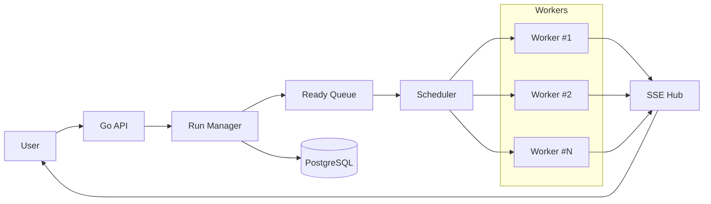
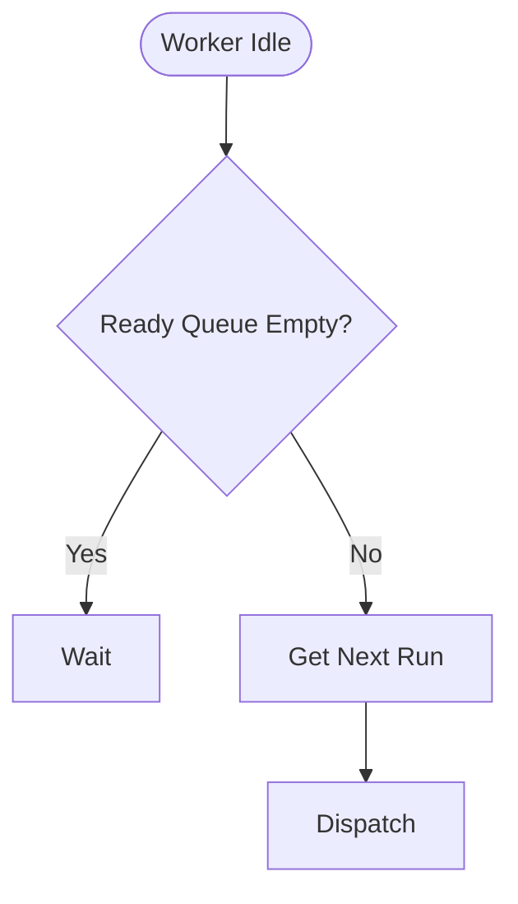
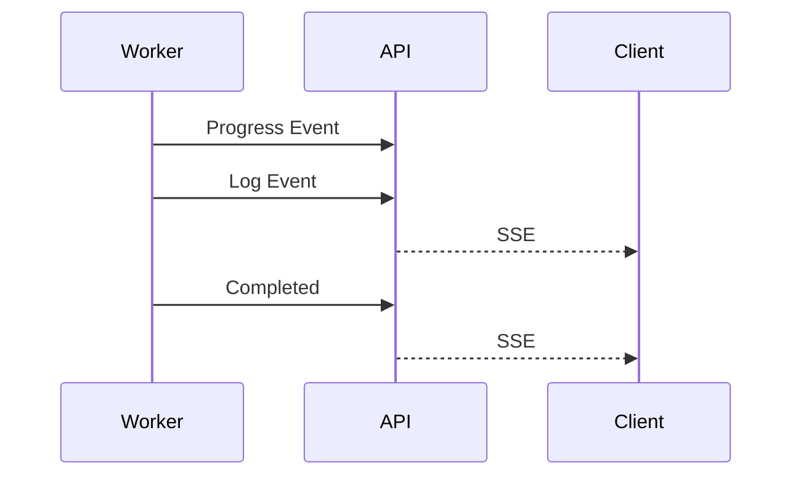
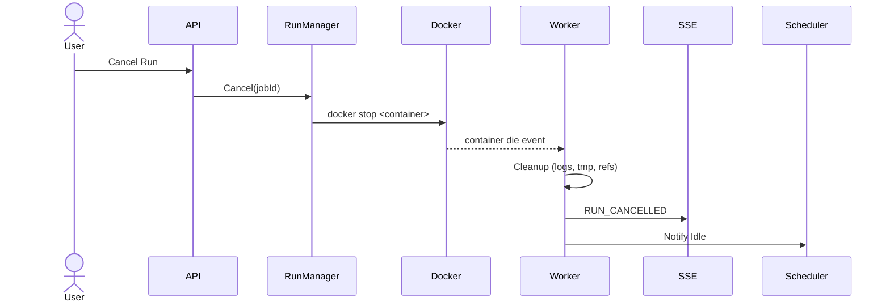
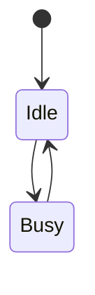
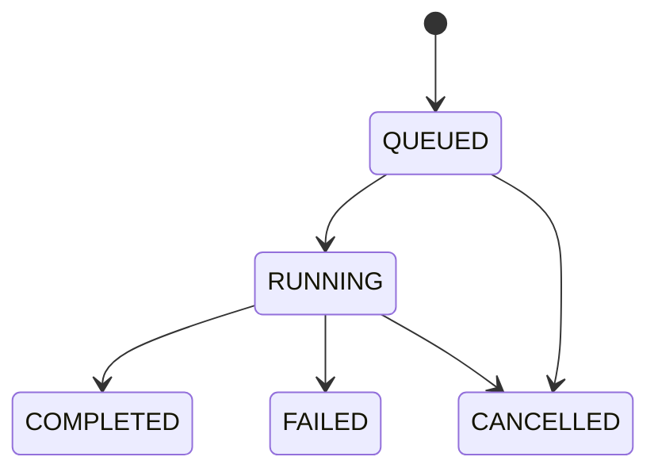
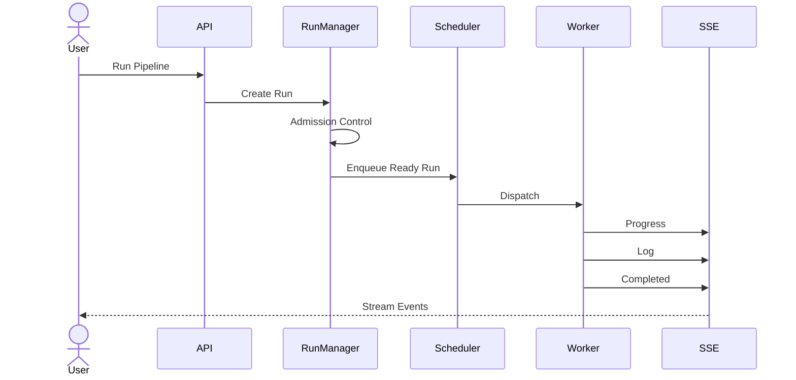

# Thiết kế hệ thống thực thi Pipeline (Execution Queue)

> Phiên bản: 1.0
> Mục tiêu: Thiết kế cơ chế thực thi pipeline theo thời gian thực, hỗ trợ giới hạn tài nguyên, hủy tác vụ và truyền trạng thái thực thi qua Server-Sent Events (SSE).

---

# 1. Mục tiêu

Hệ thống cần đáp ứng các yêu cầu sau:

* Thực thi nhiều pipeline đồng thời.
* Giới hạn số lượng Worker để tránh quá tải tài nguyên.
* Mỗi người dùng chỉ được phép chạy tối đa **N pipeline đồng thời** (ví dụ: 3).
* Người dùng có thể theo dõi log và tiến trình theo thời gian thực.
* Có thể hủy pipeline đang chạy.
* Có thể mở rộng số lượng Worker trong tương lai.

Do các Pipeline thường có thời gian thực thi dài (vài phút đến hàng giờ), hệ thống không thể xử lý theo mô hình Request-Response truyền thống mà cần cơ chế bất đồng bộ (Asynchronous Execution).

---

# 2. Kiến trúc tổng thể



Kiến trúc được chia thành bốn thành phần chính:

* Run Manager
* Ready Queue
* Scheduler
* Worker

Worker chỉ chịu trách nhiệm thực thi pipeline. Toàn bộ logic điều phối nằm tại Run Manager và Scheduler.

---

# 3. Run Manager

Run Manager là thành phần trung tâm chịu trách nhiệm điều phối toàn bộ vòng đời của một Pipeline.

Các nhiệm vụ bao gồm:

* tạo Run mới
* kiểm tra giới hạn người dùng
* lưu trạng thái vào Database
* đưa Run vào Ready Queue
* gửi yêu cầu hủy
* cập nhật trạng thái khi Worker hoàn thành

Run Manager **không trực tiếp thực thi Pipeline**.

```text
Create Run
     │
     ▼
Admission Control
     │
     ▼
Save Database
     │
     ▼
Ready Queue
```

Run Manager sử dụng **Docker SDK** như một dependency chính để tra cứu
và dừng container theo label `job_id=<id>` khi xử lý yêu cầu hủy
(xem mục 9.2). Run Manager vẫn không thực thi pipeline — nó chỉ ra lệnh
cho Docker daemon.

---

# 4. Admission Control

Admission Control chịu trách nhiệm giới hạn số lượng Pipeline đang hoạt động của mỗi người dùng.

Ví dụ:

```
Maximum Active Runs = 3
```

Nếu User A đang chạy:

```
Run1
Run2
Run3
```

thì yêu cầu:

```
Run4
```

sẽ bị từ chối hoặc trả về thông báo:

```
Maximum concurrent runs exceeded
```

Điều này giúp tránh một người dùng chiếm toàn bộ tài nguyên hệ thống.

Admission Control chỉ kiểm tra **số lượng Run đang hoạt động**, không quyết định Worker nào sẽ thực thi.

---

# 5. Ready Queue

Ready Queue lưu các Run đã sẵn sàng thực thi.

Ví dụ:

```
Ready Queue

RunA
RunB
RunC
RunD
```

Đây là hàng đợi duy nhất của hệ thống.

Queue chỉ lưu các Run hợp lệ và đang chờ Worker.

Ready Queue ban đầu được triển khai theo FIFO.

Trong tương lai có thể thay đổi Scheduler mà không cần thay đổi Queue.

---

# 6. Scheduler

Scheduler chịu trách nhiệm phân phối Run tới Worker còn rảnh.

Khác với Queue, Scheduler không lưu dữ liệu.

Scheduler chỉ đưa ra quyết định:

```
Worker rảnh?

↓

Có Run đang chờ?

↓

Dispatch
```

Luồng hoạt động:



Scheduler hiện sử dụng FIFO.

Sau này có thể thay bằng:

* Priority Queue
* Fair Scheduler
* Round Robin
* Weighted Scheduler

mà không cần thay đổi Worker.

---

# 7. Worker

Worker là thành phần thực thi Pipeline.

Worker không biết đến Queue.

Worker cũng không biết người dùng nào gửi yêu cầu.

Worker chỉ nhận:

```
Run

↓

Execute

↓

Report Progress
```

Mỗi Worker chạy độc lập trong Docker Container.

Ví dụ:

```
Worker 1

Running:
Run123

Status:
Busy
```

Khi hoàn thành:

```
Finished

↓

Idle

↓

Notify Scheduler
```

Worker cũng lắng nghe **Docker events stream** để phát hiện container
của mình bị dừng hoặc chết — kể cả khi Run Manager chủ động hủy (xem
mục 9.2), khi pipeline lỗi, hoặc khi container bị OOM-kill. Filter theo
label `job_id=<id>` của container mà Worker đang phụ trách. Khi nhận
event `die` hoặc `stop`, Worker dọn tài nguyên tạm, phát event cuối
cùng qua SSE và thông báo Scheduler chuyển về `Idle`.

---

# 8. Streaming Progress và Log

Do Pipeline có thời gian thực thi dài nên người dùng cần theo dõi tiến trình theo thời gian thực.

Hệ thống sử dụng **Server-Sent Events (SSE)**.

Luồng dữ liệu:



Các loại Event:

```
RUN_STARTED

STEP_STARTED

STEP_PROGRESS

LOG

STEP_COMPLETED

RUN_COMPLETED

RUN_FAILED

RUN_CANCELLED
```

Client chỉ cần mở một kết nối SSE và lắng nghe toàn bộ sự kiện của Pipeline.

---

# 9. Cancellation

Có hai trường hợp.

## 9.1 Run đang chờ

```
Ready Queue

RunA

RunB

RunC
```

Người dùng hủy:

```
RunB
```

Run Manager:

* xóa khỏi Ready Queue
* cập nhật trạng thái Database

Không cần tương tác với Worker.

---

## 9.2 Run đang chạy

Người dùng nhấn Cancel.

Run Manager thực hiện hủy trực tiếp thông qua **Docker API**. Worker
không cần expose thêm endpoint nội bộ.

**Luồng xử lý:**



**Cơ chế:**

* Mỗi container khi Worker tạo đều gắn label `job_id=<uuid>` và
  `managed_by=training-ml-pipeline`.
* Run Manager tra cứu container theo label:
  `docker ps --filter label=job_id=<id>`.
* Run Manager gọi `docker stop` (SIGTERM, grace 10s) hoặc `docker kill`
  (SIGKILL tức thì) tuỳ chính sách hủy của Run. Docker chịu trách nhiệm
  chuyển tín hiệu tới pipeline process bên trong container.
* Worker lắng nghe Docker events stream, lọc theo `job_id` của mình.
  Khi thấy container `die` hoặc `stop`, Worker:
  * phát event `RUN_CANCELLED` qua SSE Hub kèm metadata dọn dẹp,
  * giải phóng tài nguyên tạm (volume, log buffer),
  * thông báo Scheduler chuyển về `Idle`.

**Vì sao không cần Control Channel riêng:**

* Kênh điều khiển đã tồn tại sẵn — đó là Docker daemon. Cả Run Manager
  (gửi lệnh stop) và Worker (lắng nghe events) đều đã giao tiếp với
  Docker, không cần thêm giao thức mới.
* Không dùng Cancellation Queue vì `docker stop` xử lý tức thì, không bị
  chặn bởi hàng đợi pipeline. Worker quan sát theo event-driven, độ trễ
  chỉ tính bằng millisecond.
* Việc hủy không phụ thuộc vào trạng thái trong bộ nhớ của Worker:
  nguồn sự thật duy nhất là Docker. Kể cả Worker crash giữa chừng,
  container vẫn được dọn bởi Run Manager hoặc bởi Docker restart policy.

---

# 10. Worker State



---

# 11. Run State



---

# 12. Luồng thực thi tổng quát



---

# 13. Ưu điểm của kiến trúc

* **Tách biệt trách nhiệm**:

  * Run Manager quản lý vòng đời của Run.
  * Scheduler điều phối tài nguyên.
  * Worker chỉ thực thi Pipeline.

* **Khả năng mở rộng**:

  * Có thể tăng số lượng Docker Worker mà không thay đổi kiến trúc.
  * Có thể thay đổi thuật toán Scheduler (FIFO, Fair Scheduling, Priority Scheduling, v.v.) mà không ảnh hưởng tới Worker.

* **Streaming thời gian thực**:

  * Sử dụng **Server-Sent Events (SSE)** giúp client nhận log và tiến trình liên tục với chi phí thấp hơn WebSocket trong trường hợp chỉ cần truyền dữ liệu một chiều từ server tới client.

* **Hỗ trợ hủy tác vụ**:

  * Các Run đang chờ được loại bỏ trực tiếp khỏi Ready Queue.
  * Các Run đang chạy được dừng ngay thông qua **Control Channel**, đảm bảo giải phóng tài nguyên kịp thời.

Kiến trúc này phù hợp với các hệ thống thực thi Pipeline hoặc Workflow chạy trên Docker, nơi tài nguyên tính toán cần được kiểm soát nhưng người dùng vẫn mong muốn nhận phản hồi và theo dõi tiến trình gần như theo thời gian thực.
